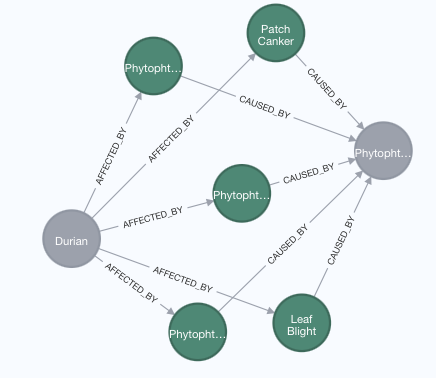
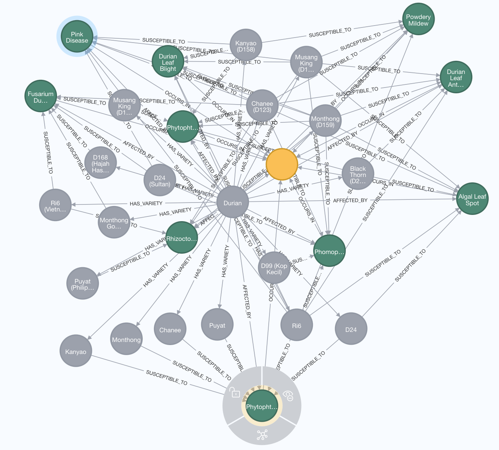

# Basic Neo4j Knowledge Graph

## Project Overview

This repository contains a minimal pipeline to construct and query a Neo4j knowledge graph.

## Getting Started
### Prerequisites

- [Docker](https://docs.docker.com/get-docker/)
- [uv](https://docs.astral.sh/uv/) (optional, for local development)

### Installation

1.  Clone the repository:
    ```bash
    git clone https://github.com/phung-pham-vns/basic_knowledge_graph.git
    cd basic_knowledge_graph
    ```
2.  Configure environment
Create a `.env` file at repo root. The defaults in `src/settings.py` are shown; override as needed.

```env
# LLM
llm_provider=openai
llm_model=gpt-4.1-mini
llm_api_key=YOUR_OPENAI_API_KEY
llm_temperature=0.0

# Graph DB
graph_db_provider=neo4j
# Bolt: bolt://host:7687, Neo4j URI: neo4j://host:7687
graph_db_url=neo4j://localhost:7687
graph_db_user=neo4j
graph_db_password=your_password
```

Optional: start Neo4j via Docker (adjust password to match `.env`).
```bash
docker compose up -d
```

3. Create virtual environment and install packages

```
uv venv
uv sync
```

## Usage

1. Build the knowledge graph
`src/construct.py` reads a spreadsheet, extracts entities/relations via LLM, and writes to Neo4j.

Update the file path and sheet name as needed in `src/construct.py` (main section) or run it directly:
```bash
python src/construct.py
```

If you want to call the function from your own script:
```python
from src.construct import construct_knowledge_graph
import asyncio

asyncio.run(
    construct_knowledge_graph(
        data_path="docs/data/durian_pest_and_disease_data.xlsx",
        sheet_name="(3) Diseases Information",
        ignored_column_names=["No.", "References"],
    )
)
```

2. Query the knowledge graph
`src/retrieve.py` builds a Cypher-QA chain over Neo4j and prints the result of a sample query.
```bash
python src/retrieve.py
```

# Retrieval

## Example 1.

- Question & Response

```bash
Question: Which diseases on durian caused by Phytophthora Palmivora?


> Entering new GraphCypherQAChain chain...
Generated Cypher:
cypher
MATCH (d:Disease)-[:CAUSED_BY]->(p:Pathogen {id: "Phytophthora Palmivora"}),
      (c:Crop {id: "Durian"})-[:AFFECTED_BY]->(d)
RETURN d.id AS Disease

Full Context:
[{'Disease': 'Leaf Blight'}, {'Disease': 'Phytophthora Root Rot'}, {'Disease': 'Patch Canker'}, {'Disease': 'Phytophthora Fruit Rot Of Durian'}, {'Disease': 'Phytophthora Patch Canker'}]

> Finished chain.
Answer: The diseases on durian caused by Phytophthora Palmivora are Phytophthora Root Rot, Phytophthora Fruit Rot Of Durian, and Phytophthora Patch Canker.
```

- Graph Execution

|Visualization|
|:--:|
||

```bash
MATCH (crop:Crop {id: "Durian"})
MATCH (pathogen:Pathogen {id: "Phytophthora Palmivora"})
MATCH p = (crop)-[:AFFECTED_BY]->(d:Disease)-[:CAUSED_BY]->(pathogen)
RETURN p;
```

## Example 2.

- Question & Response

```bash
Question: Which disease in Thailand affects the most durian varieties?


> Entering new GraphCypherQAChain chain...
Generated Cypher:
cypher
MATCH (loc:Location {id: "Thailand"})<-[:OCCURS_IN]-(d:Disease)<-[:SUSCEPTIBLE_TO]-(v:Variety)<-[:HAS_VARIETY]-(c:Crop {id: "Durian"})
RETURN d.id AS disease, COUNT(DISTINCT v) AS varietyCount
ORDER BY varietyCount DESC
LIMIT 1

Full Context:
[{'disease': 'Phytophthora Patch Canker', 'varietyCount': 6}]

> Finished chain.
Answer: Phytophthora Patch Canker affects the most durian varieties in Thailand, impacting 6 different varieties.
```

- Graph Execution

|Visualization|
|:--:|
||

```bash
MATCH p=(loc:Location {id: "Thailand"})<-[:OCCURS_IN]-(d:Disease)<-[:SUSCEPTIBLE_TO]-(v:Variety)<-[:HAS_VARIETY]-(c:Crop {id: "Durian"})
RETURN p;
```
